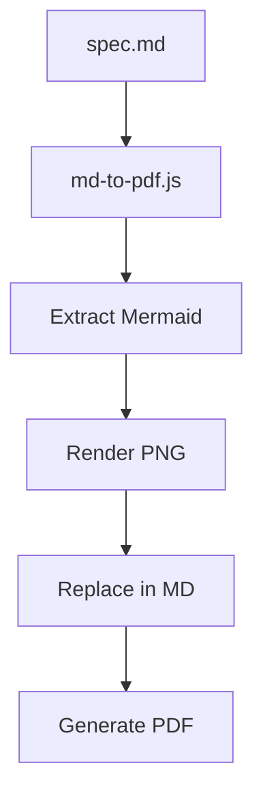

## User Input

```text
$ARGUMENTS
```

You **MUST** consider the user input before proceeding (if not empty).

## Purpose

Generate a print-optimized PDF document directly from Markdown source files with:
- **Automatic Mermaid rendering**: Diagrams converted to PNG images automatically
- **Professional formatting**: A4 format with proper margins and typography
- **Source control friendly**: Markdown remains the single source of truth
- **Fast generation**: ~15 seconds vs manual browser printing

**Why this exists**: Working with AI involves extensive screen time that can cause visual stress. This command creates professional PDFs from your specification files for offline review, reducing screen fatigue during development.

## Execution Steps

### Step 1: Initialize Context

Run `{SCRIPT}` once from repository root and parse the JSON output to get:

- `FEATURE_SPEC`: Path to spec.md (technical specification)
- `SPEC_STAK`: Path to spec-stak.md (stakeholder documentation)
- `SPEC_PDF`: Output path for spec.pdf
- `STAK_PDF`: Output path for spec-stak.pdf
- `FEATURE_DIR`: Feature directory path
- `BRANCH`: Current feature branch name
- `STAK_EXISTS`: "true" if spec-stak.md available, "false" otherwise
- `IMAGES_DIR`: Path where Mermaid diagram PNGs will be saved
- `HAS_GIT`: "true" if git repository, "false" otherwise

### Step 2: Determine Target Files

Based on user input and available files:

**If user specified a file** (e.g., "spec.md", "plan.md"):
- Use that specific file as target

**If no file specified**:
- If `STAK_EXISTS == "true"`: Default to spec-stak.md (stakeholder-friendly)
- If `STAK_EXISTS == "false"`: Default to spec.md (technical)

**Available targets** in a typical feature directory:
- `spec.md` - Technical specification
- `spec-stak.md` - Stakeholder documentation
- `plan.md` - Implementation plan
- `tasks.md` - Task list
- Any other `.md` file

### Step 3: Check Prerequisites

Before generating PDF, verify:

1. **Target file exists**:
   ```
   if [ ! -f "$TARGET_FILE" ]; then
       echo "ERROR: File not found: $TARGET_FILE"
       exit 1
   fi
   ```

2. **Node.js available** (for md-to-pdf):
   ```
   if ! command -v node &> /dev/null; then
       echo "ERROR: Node.js required. Install from https://nodejs.org/"
       exit 1
   fi
   ```

3. **Optional: Puppeteer for Mermaid** (will fallback gracefully if missing)

### Step 4: Generate PDF

Execute the PDF generation script:

**Option A: Using the bash script directly**:
```bash
scripts/bash/generate-print.sh --generate [target-file.md]
```

**Option B: Using Node.js script directly**:
```bash
node scripts/node/md-to-pdf.js [target-file.md]
```

**What happens during generation**:

1. **Extract Mermaid blocks**: Find all ```mermaid code blocks in the markdown
2. **Render diagrams as PNG**: Use Puppeteer + Mermaid CDN to render each diagram
3. **Save images**: Store PNGs in `IMAGES_DIR/diagram-X.png`
4. **Replace in markdown**: Substitute Mermaid blocks with ``
5. **Convert to PDF**: Use md-to-pdf with A4 format and proper margins
6. **Cleanup**: Remove temporary files

### Step 5: Report Results

After successful generation, report:

```
✓ PDF gerado com sucesso!

Arquivo: [OUTPUT_PDF]
Imagens: [IMAGES_DIR]/ (X diagramas renderizados)

Para visualizar:
  open [OUTPUT_PDF]              # macOS
  xdg-open [OUTPUT_PDF]          # Linux
  start [OUTPUT_PDF]             # Windows

Dica: O PDF mantém o Markdown como fonte única.
      Edite o .md e regenere o PDF quando necessário.
```

### Step 6: Handle Multiple Files (Optional)

If user wants to generate PDFs for multiple files:

```bash
# Generate all main artifacts
for file in spec.md spec-stak.md plan.md tasks.md; do
    if [ -f "$FEATURE_DIR/$file" ]; then
        scripts/bash/generate-print.sh --generate "$file"
    fi
done
```

## Operating Principles

1. **Markdown as Source**: Never edit PDFs directly - always edit the `.md` file and regenerate
2. **Automatic Diagrams**: Mermaid diagrams are rendered as PNG automatically
3. **Git Friendly**: Images in `images/` can be committed for offline viewing
4. **Fast Iteration**: ~15 seconds per PDF vs ~5 minutes manual browser printing
5. **Graceful Fallback**: Works without Puppeteer (Mermaid won't render, but PDF still generates)

## Mermaid Diagram Support

The following Mermaid diagram types are supported:

- `sequenceDiagram` - User journeys, API flows
- `graph TD/LR` - Flowcharts, architecture diagrams
- `erDiagram` - Entity relationship diagrams
- `gantt` - Project timelines
- `classDiagram` - Class structures
- `stateDiagram` - State machines
- `pie` - Pie charts

**Example**:


## Troubleshooting

### Diagrams not rendering

**Cause**: Puppeteer not installed

**Solution**:
```bash
npm install puppeteer
```

### PDF generation fails

**Cause**: md-to-pdf not available

**Solution**:
```bash
# It uses npx, so should work automatically
# If not, install globally:
npm install -g md-to-pdf
```

### Large diagrams cut off

**Cause**: Diagram too complex for default viewport

**Solution**: Edit `scripts/node/md-to-pdf.js` and increase viewport:
```javascript
await page.setViewport({ width: 1600, height: 1200 });
```

### Timeout on complex diagrams

**Cause**: Rendering takes too long

**Solution**: Increase timeout in script:
```javascript
await new Promise(resolve => setTimeout(resolve, 5000)); // 5 seconds
```

## Output Files

After running the command:

```
specs/{feature-id}/
├── spec.md              # Source (edit this)
├── spec.pdf             # Generated PDF
├── spec-stak.md         # Source (edit this)
├── spec-stak.pdf        # Generated PDF
├── plan.md              # Source
├── plan.pdf             # Generated PDF (if requested)
└── images/              # Mermaid diagrams as PNG
    ├── diagram-0.png
    ├── diagram-1.png
    └── ...
```

## Integration with Other Commands

**After /speckit.specify**:
```
Use /print to generate a PDF of the technical specification.
```

**After /speckit.stak**:
```
Use /print to generate a professional PDF for stakeholder distribution.
```

**After /speckit.plan**:
```
Use /print plan.md to generate a PDF of the implementation plan.
```

## Quick Reference

```bash
# Generate PDF of default file (spec-stak.md or spec.md)
scripts/bash/generate-print.sh --generate

# Generate PDF of specific file
scripts/bash/generate-print.sh --generate spec.md
scripts/bash/generate-print.sh --generate plan.md

# Show available paths (JSON for agents)
scripts/bash/generate-print.sh --json

# Show help
scripts/bash/generate-print.sh --help
```

## Benefits Over HTML Printing

| Aspect | Old (HTML → Browser Print) | New (MD → PDF) |
|--------|---------------------------|----------------|
| **Process** | Manual (Ctrl+P) | Automatic |
| **Time** | ~5 minutes | ~15 seconds |
| **Diagrams** | Manual rendering | Automatic PNG |
| **Source** | HTML + MD (two files) | MD only (single source) |
| **Consistency** | Varies by browser | Always consistent |
| **Git Friendly** | Hard to diff HTML | Clean MD diffs |
