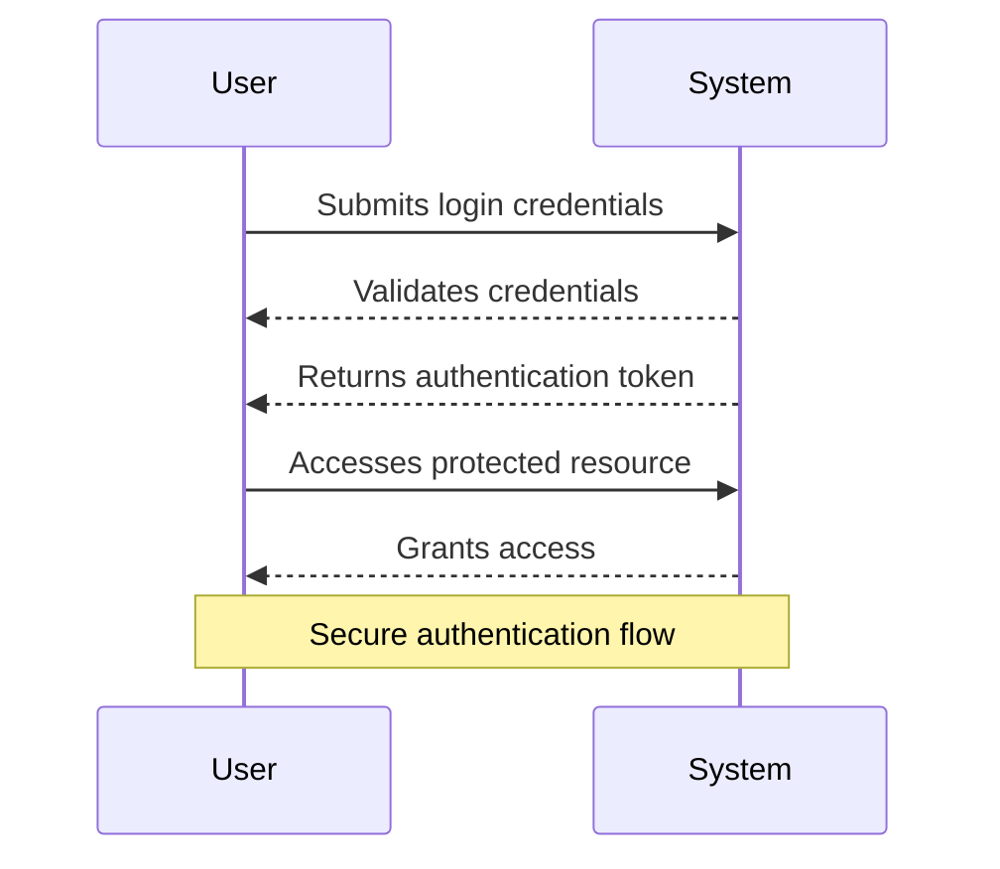
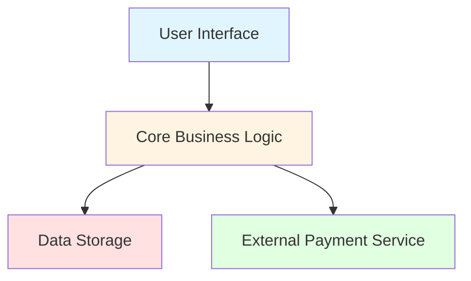
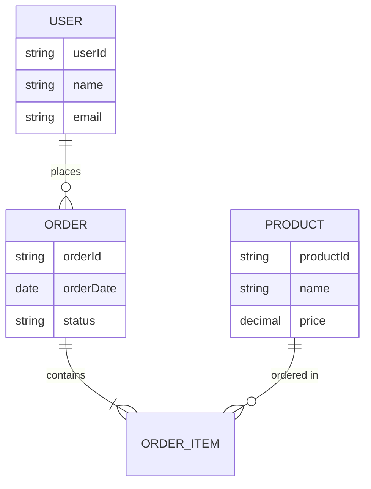
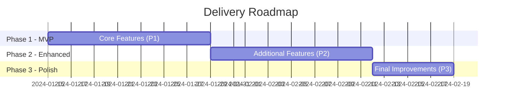
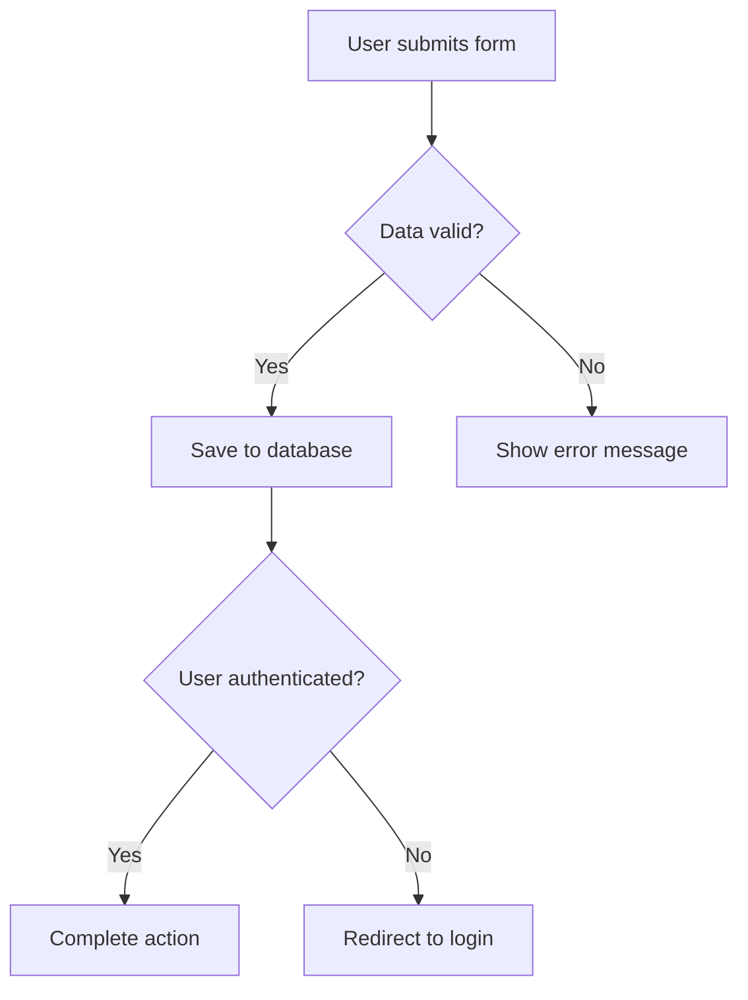

## User Input

```text
$ARGUMENTS
```

You **MUST** consider the user input before proceeding (if not empty).

## Purpose

Transform the technical `spec.md` into an executive-friendly `spec-stak.md` that:

- Uses visual Mermaid diagrams for clarity (sequence, architecture, timeline, ERD, flowcharts)
- Focuses on business value, not technical implementation details
- Tracks approvals, decisions, and changes over time
- Provides ROI and business metrics in stakeholder-friendly language
- Can be updated incrementally as spec.md evolves while preserving manual edits

## Execution Steps

### Step 1: Initialize Context

Run `{SCRIPT}` once from repository root and parse the JSON output to get:

- `FEATURE_SPEC`: Path to spec.md (input source - technical specification)
- `SPEC_STAK`: Path to spec-stak.md (output target - stakeholder documentation)
- `FEATURE_DIR`: Feature directory path
- `BRANCH`: Current feature branch name
- `STAK_EXISTS`: "true" if updating existing doc, "false" if creating new
- `SPEC_MODIFIED`: Unix timestamp of spec.md last modification
- `HAS_GIT`: "true" if git repository, "false" otherwise

**Script execution notes**:

- The script validates that spec.md exists (prerequisite)
- If spec-stak.md doesn't exist, script copies the template
- For single quotes in args like "I'm Groot", use escape syntax: `'I'\''m Groot'` (or double-quote if possible: `"I'm Groot"`)

### Step 2: Load Source Content

Read the following files to gather all necessary information:

1. **`FEATURE_SPEC` (spec.md)** - Extract:
   - Feature name and metadata (branch, date, status)
   - User Scenarios & Testing section (all user stories with priorities P1/P2/P3)
   - Requirements section (all FR-XXX functional requirements)
   - Success Criteria section (all SC-XXX measurable outcomes)
   - Edge Cases section
   - Key Entities section (data model concepts)
   - Assumptions section (if present)
   - Any `[NEEDS CLARIFICATION]` markers

2. **`SPEC_STAK` (if exists)** - Extract existing content to preserve:
   - Approval & Governance → Approval Status table (preserve completely)
   - Approval & Governance → Decision Log (preserve all entries)
   - Approval & Governance → Change History (preserve all entries)
   - Any content marked with `<!-- STAKEHOLDER: [name] -->`
   - Any content marked with `<!-- PRESERVE -->`
   - Current version number from Change History

3. **`/memory/constitution.md` (if exists)** - Reference:
   - Project principles and gates
   - Company values and strategic priorities (if documented)

### Step 3: Determine Mode - Create vs Update

**If STAK_EXISTS == "false" (CREATE MODE)**:

- Generate complete spec-stak.md from scratch
- Initialize all sections with content derived from spec.md
- Set Status to "Pending Approval"
- Create empty Approval Status table with placeholder rows
- Generate all applicable Mermaid diagrams
- Set Version to "1.0" in Change History

**If STAK_EXISTS == "true" (INCREMENTAL UPDATE MODE)**:

- Parse existing spec-stak.md to extract preservation-priority content
- **NEVER modify these sections** (preserve exactly as-is):
  - Approval & Governance → Approval Status table
  - Approval & Governance → Decision Log (only append new entries if explicitly requested)
  - Approval & Governance → Change History (only append new version entry)
  - Any paragraphs/sections with `<!-- STAKEHOLDER: ... -->` comments
  - Any content with `<!-- PRESERVE -->` tags
- **Update these sections** with new spec.md content:
  - Executive Summary (regenerate if requirements/scope changed significantly)
  - Business Case → Success Metrics (regenerate from success criteria)
  - User Impact & Value → All user stories and value delivery
  - User Impact & Value → User Journey diagram (regenerate from P1 user story)
  - Implementation Overview → All diagrams (regenerate if entities/flows changed)
  - Risk Assessment (update based on edge cases)
- **Append to Change History**:
  - Parse existing version number (e.g., "1.2")
  - Increment minor version (1.2 → 1.3)
  - Add new row with date, what changed, and "AI Agent" as author

### Step 4: Content Transformation Rules

Transform technical language from spec.md into executive/business language:

**Language Simplification Guidelines**:

| Technical Term | Business Language |
| --- | --- |
| Authentication service | User login system |
| API endpoint | Connection point / Integration |
| Database schema | Data structure |
| Refactoring | Improving code quality |
| Microservices | System components |
| Cache | Temporary storage for speed |
| Load balancer | Traffic distribution system |
| Message queue | Task coordination system |
| OAuth2 / JWT | Secure login method |
| SQL / NoSQL | Data storage approach |

**Focus**: Always frame in terms of WHAT users can do and WHY it matters to the business, never HOW it's implemented technically.

**Metrics Transformation**:

- "API latency < 200ms" → "Instant response for users (under 0.2 seconds)"
- "Database throughput 1000 TPS" → "Support 1000 simultaneous user actions per second"
- "99.9% uptime SLA" → "Available 24/7 with minimal downtime (99.9% reliability)"
- "Horizontal scaling" → "Grows to handle increased user demand"

### Step 5: Generate Mermaid Diagrams

Apply these heuristics to determine which diagrams to generate:

#### A. User Journey Sequence Diagram (ALWAYS GENERATE)

**Source**: Priority 1 (P1) user story from spec.md User Scenarios section

**Logic**:

1. Find the first P1 user story
2. Extract Given/When/Then acceptance scenarios
3. Convert to sequence diagram interactions (limit: 6-8 steps)
4. Use `User` and `System` as participants
5. Add `Note` for critical context

**Example**:



#### B. High-Level Architecture Diagram (ALWAYS GENERATE)

**Source**: Key Entities section from spec.md

**Logic**:

1. Identify all entities in Key Entities section
2. Abstract to major system components (3-5 components)
3. Use business-friendly component names
4. Show relationships with arrows
5. Apply color styling for visual hierarchy

**Component naming**:

- If entities include User, Account, Profile → Component: "User Management"
- If entities include Order, Payment, Cart → Component: "Transaction Processing"
- If entities include Product, Category, Inventory → Component: "Product Catalog"
- External integrations → Component: "External Services"
- Always include: "User Interface", "Core System", "Data Storage"

**Example**:



#### C. Entity Relationship Diagram (CONDITIONAL)

**Generate if**: 3+ entities exist in Key Entities section with clear relationships

**Logic**:

1. Extract entity names from Key Entities section
2. Identify relationships (one-to-many, many-to-many)
3. Include 3-5 key attributes per entity (in business language)
4. Use cardinality notation

**Example**:



#### D. Implementation Timeline Gantt Chart (CONDITIONAL)

**Generate if**: Multiple priority levels exist (P1, P2, P3) in User Scenarios

**Logic**:

1. Count user stories by priority (P1, P2, P3)
2. Create phases: Phase 1 (P1 stories), Phase 2 (P2 stories), Phase 3 (P3 stories)
3. Estimate duration based on story count:
   - 1-2 stories = 1 week
   - 3-4 stories = 2 weeks
   - 5+ stories = 3 weeks
4. Use sequential phases (Phase 2 starts when Phase 1 ends)

**Example**:



#### E. Decision Flowchart (CONDITIONAL)

**Generate if**: 5+ edge cases OR complex conditional logic in Edge Cases section

**Logic**:

1. Extract major decision points from Edge Cases
2. Identify yes/no branches or multiple options
3. Show outcomes for each path
4. Limit to 3-4 decision nodes for readability

**Example**:



### Step 6: Populate Business Case Section

#### Problem Statement

- Extract from spec.md introduction or user scenarios
- Rephrase in business language (user pain points, market opportunity)

#### Proposed Solution

- Summarize P1 user stories in 2-3 paragraphs
- Focus on capabilities users gain, not technical implementation

#### Success Metrics Table

- Convert each SC-XXX success criterion from spec.md to table row
- Extract target values
- Define measurement method in business terms
- Estimate timeline (typically 1-3 months post-launch for adoption metrics)

**Example**:

| Metric | Target | Measurement Method | Timeline |
| --- | --- | --- | --- |
| User adoption rate | 1000 active users | Analytics dashboard | 3 months post-launch |
| Task completion time | Under 2 minutes | User testing and analytics | At launch |
| Customer satisfaction | 90% positive rating | Post-interaction survey | Ongoing |

#### ROI Section

If user provides ROI information in arguments, use it. Otherwise, use this approach:

**Do NOT prompt user for ROI data** - instead, populate with estimation placeholders:

**Estimated Costs**:

- Development: [Pending estimate - based on implementation plan]
- Resources: [Pending resource allocation]
- Infrastructure: [Pending infrastructure assessment]

**Expected Benefits**:

- [Benefit derived from success criteria 1]
- [Benefit derived from success criteria 2]
- [Qualitative benefit from user value]

**ROI Timeline**: [Pending business case analysis]

**Note**: Add comment `<!-- ROI estimates to be refined with stakeholder input during review -->`

### Step 7: Populate User Impact & Value Section

#### Primary User Personas

- Extract from User Scenarios or infer from requirements
- List 2-4 user types with brief descriptions

#### User Journey Visualization

- Insert the User Journey Sequence Diagram generated in Step 5A

#### Value Delivery by Priority

- Group user stories by priority (P1, P2, P3)
- For each story, write in business language:
  - **Story title** (without technical details)
  - **User benefit** (what users can accomplish)
  - **Business value** (why this matters) - for P1 only

### Step 8: Populate Implementation Overview Section

#### High-Level Architecture

- Insert the Architecture Diagram generated in Step 5B
- List 3-5 key components with business-language descriptions

#### Delivery Phases

- Insert Timeline Gantt Chart if generated (Step 5D)
- Describe what's delivered in each phase

#### Key Entities & Data Model

- Insert ERD if generated (Step 5C)
- Provide 1-2 sentence explanation of data model in business terms

### Step 9: Populate Risk Assessment Section

#### Identified Risks

- Extract from Edge Cases section in spec.md
- Convert to risk statements (what could go wrong)
- Estimate likelihood and impact (High/Med/Low)
- Suggest mitigation strategies
- Leave Owner as "[To be assigned]"

**Example conversion**:

- Edge case: "What if user uploads file over 100MB?"
- Risk: "Large file uploads may cause performance issues | Likelihood: Med | Impact: Med | Mitigation: Implement file size limits and validation"

#### Dependencies & Constraints

- Extract from spec.md if mentioned
- List external dependencies (APIs, services, data sources)
- List technical constraints in business language
- List business constraints (timeline, budget, resources)

### Step 10: Populate Decision Framework Section

#### Assumptions Made

- Extract from Assumptions section in spec.md if present
- List 3-5 key assumptions

#### Open Questions

- Extract any `[NEEDS CLARIFICATION]` markers from spec.md
- Rephrase as questions for stakeholder decision
- Prioritize (High/Med/Low)

#### Alternatives Considered

- Leave empty with placeholder: "[To be documented during planning phase]"

### Step 11: Populate Approval & Governance Section

#### Approval Status Table

**For CREATE MODE**:

```markdown
| Stakeholder | Role | Status | Date | Comments |
|-------------|------|--------|------|----------|
| [To be assigned] | Executive Sponsor | Pending | - | - |
| [To be assigned] | Product Owner | Pending | - | - |
| [To be assigned] | Technical Lead | Pending | - | - |
```

**For UPDATE MODE**:

- Read existing table from current spec-stak.md
- Preserve ALL rows exactly as-is (do not modify Status, Date, or Comments)
- Only add new rows if user explicitly provides: "Add approver: [Name], [Role]"

#### Decision Log Table

**For CREATE MODE**:

- Leave empty (no decisions yet)

**For UPDATE MODE**:

- Read existing entries
- Preserve all existing entries
- Append new entries ONLY if user explicitly provides decision information

#### Change History Table

**For CREATE MODE**:

```markdown
| Version | Date | Changes | Author | Reason |
|---------|------|---------|--------|--------|
| 1.0 | [TODAY'S DATE] | Initial stakeholder documentation | AI Agent | Created from spec.md |
```

**For UPDATE MODE**:

1. Read existing table
2. Parse latest version number (e.g., "1.2")
3. Increment minor version: 1.2 → 1.3
4. Append new row:

```markdown
| 1.3 | [TODAY'S DATE] | [Summarize what sections changed] | AI Agent | Updated from spec.md changes |
```

### Step 12: Validation Checklist

Before writing the final spec-stak.md file, verify:

**Content Quality**:

- [ ] Executive Summary uses no technical jargon (no "API", "database", "service", "endpoint")
- [ ] Business Case focuses on user value and ROI, not implementation
- [ ] All metrics in Success Metrics table are measurable and include target values
- [ ] User stories are written in business language (no code, frameworks, or libraries)

**Diagram Quality**:

- [ ] At least 2 diagrams generated (User Journey + Architecture minimum)
- [ ] All Mermaid diagrams use valid syntax (test: proper keywords, arrows, braces)
- [ ] Sequence diagram limited to 6-8 steps (readability)
- [ ] Architecture diagram uses color styling (fill:#... for visual hierarchy)
- [ ] Gantt chart has valid dateFormat and reasonable durations

**Preservation (Update Mode Only)**:

- [ ] Approval Status table preserved exactly (no changes to Status/Date/Comments)
- [ ] Decision Log has all previous entries (no deletions)
- [ ] Change History has new version entry with incremented version number
- [ ] Any `<!-- STAKEHOLDER: ... -->` sections preserved

**Completeness**:

- [ ] All sections have content (no "[TODO]" markers)
- [ ] All tables are properly formatted (aligned pipes, proper headers)
- [ ] Change History version matches document status
- [ ] Appendix links point to correct file paths

**If validation fails**:

- Fix issues before writing file
- If critical content missing from spec.md, add note: "[Pending spec.md completion]"
- If unable to generate diagram due to insufficient data, include placeholder with explanation

### Step 13: Write Complete spec-stak.md

Use atomic write strategy:

1. Build complete content in memory
2. Validate all sections present
3. Replace placeholders:
   - `[FEATURE NAME]` → actual feature name from spec.md
   - `[###-feature-name]` → actual branch name
   - `[DATE]` → today's date in YYYY-MM-DD format
   - `[TODAY'S DATE]` → today's date
4. Write entire file to `SPEC_STAK` path in one operation
5. Preserve original file permissions if updating

**Do NOT**:

- Write incrementally (build in memory first)
- Modify file multiple times (single atomic write)
- Change file permissions on update

### Step 14: Report Completion

Output a summary to the user:

```text
✓ Stakeholder documentation generated: [SPEC_STAK path]
✓ Mode: [CREATE/INCREMENTAL UPDATE]
✓ Diagrams generated: [list diagram types - e.g., "User Journey, Architecture, Timeline"]
✓ Status: [Pending Approval / current status]
✓ Version: [version number - e.g., "1.0" or "1.3"]

Summary of changes (if update mode):
- [List what sections were regenerated]
- [Note what was preserved]

Next Steps:
1. Review spec-stak.md for accuracy and completeness
2. Share with stakeholders for approval
3. Update Approval Status table as approvals are received
4. Add entries to Decision Log as major decisions are made
5. Run /speckit.stak again if spec.md is updated (incremental mode will preserve approvals)
6. Proceed to /speckit.plan for technical planning when ready

Manual Editing Instructions:
- Update Approval Status table by editing Status/Date/Comments columns
- Add Decision Log entries by appending new rows to the table
- Add stakeholder-specific notes with <!-- STAKEHOLDER: [your name] --> comments
- Mark sections to preserve with <!-- PRESERVE --> tags
- All manual edits will be preserved in future /speckit.stak updates
```

## Operating Principles

### 1. Preservation Rules (Incremental Mode)

**NEVER modify**:

- Approval Status entries (Status, Date, Comments columns)
- Decision Log entries (any existing rows)
- Content marked with `<!-- STAKEHOLDER: ... -->`
- Content marked with `<!-- PRESERVE -->`

**ALWAYS preserve**:

- Manual formatting changes in preserved sections
- Custom stakeholder comments and annotations
- Approval signatures and timestamps

**ALWAYS append** (never delete):

- Change History entries
- Decision Log entries (only when explicitly requested by user)

**Smart update**:

- Only regenerate sections when source content meaningfully changed
- Add `<!-- AUTO-GENERATED: [section] - Last updated: [date] -->` markers to auto-updated sections
- Detect manual edits by looking for `<!-- MANUAL-EDIT: [date] -->` markers

### 2. Business Language Guidelines

**Avoid these terms**:

- refactoring, API, database, schema, endpoint, service, microservice
- REST, GraphQL, SQL, NoSQL, ORM, cache, queue
- framework names (React, Django, Express, etc.)
- language names (Python, JavaScript, Go, etc.)
- deployment terms (Docker, Kubernetes, CI/CD, etc.)

**Use these instead**:

- improving code quality, connection, storage, structure, feature, system, component
- data retrieval method, stored data, data organization, speed optimization, task coordination
- web technology, programming approach, development tool
- deployment process, automation, continuous delivery

**Frame everything**:

- In terms of user value (what users can DO)
- With business impact (revenue, cost savings, efficiency, user satisfaction)
- With concrete metrics (time saved, users served, errors reduced)
- Without vague adjectives ("better", "improved", "optimized" → use specific metrics)

### 3. Diagram Quality Standards

**Sequence Diagrams**:

- Limit to 6-8 interactions (readability)
- Use clear participant names (User, System, External Service)
- Include Note blocks for critical context
- Show both success and key error paths if complex

**Architecture Diagrams**:

- 3-6 components maximum (high-level only)
- Use color styling for visual hierarchy (fill:#colorcode)
- Label relationships clearly
- Abstract technical details to business components

**Entity Relationship Diagrams**:

- 3-5 entities maximum (core entities only)
- 3-5 attributes per entity (key fields only)
- Use business-friendly field names
- Show cardinality (||--o{) clearly

**Timeline Diagrams**:

- 3-4 phases maximum
- Use realistic date ranges
- Label phases clearly (MVP, Enhanced, Polish)
- Show parallel work if applicable

**Validate Mermaid syntax**:

- Check for proper keywords (sequenceDiagram, graph, erDiagram, gantt, flowchart)
- Verify arrow syntax (-->, -->, ->>)
- Ensure braces and quotes are balanced
- Test that node IDs don't have spaces or special characters

### 4. Error Handling

**If spec.md is incomplete**:

- Generate partial spec-stak.md with placeholders
- Mark missing sections with: "[Pending spec.md completion - [section name]]"
- Include note at top: "⚠️ This stakeholder document is based on an incomplete technical specification. Some sections are placeholders pending spec.md updates."

**If diagram generation fails**:

- Include text-based placeholder:

```markdown
## [Diagram Title]

[Diagram could not be auto-generated due to insufficient data in spec.md]

**Key points to illustrate**:
- [Point 1 from source content]
- [Point 2 from source content]
```

**If ROI data unavailable**:

- Use placeholders: "[Pending stakeholder input]"
- Add comment: `<!-- ROI estimates require business case analysis and stakeholder input -->`

**Never fail completely**:

- Always generate spec-stak.md, even if partial
- Clearly mark gaps and placeholders
- Provide instructions for manual completion

## Special Cases

### Case 1: User Provides Additional Context in Arguments

If `$ARGUMENTS` contains specific instructions beyond just running the command:

- Parse the arguments for:
  - Stakeholder names and roles: "Add approver: John Smith, VP Engineering"
  - ROI data: "Expected savings: $50k/year, Development cost: 4 weeks"
  - Specific decisions: "Decision: Use OAuth2 for authentication - decided by Security Team"
  - Custom metrics: "Target: 5000 users in first month"

- Apply this information:
  - Add to Approval Status table
  - Populate ROI section with provided values
  - Add to Decision Log
  - Override auto-generated success metrics with user-provided ones

### Case 2: Multiple Update Runs in Same Session

If user runs `/speckit.stak` multiple times:

- First run: CREATE mode (generates from spec.md)
- Second run: UPDATE mode (incremental update)
- Third+ runs: UPDATE mode (continue preserving and updating)

Each run should increment version appropriately and track changes.

### Case 3: Spec.md Has Been Significantly Revised

If SPEC_MODIFIED timestamp is very recent and UPDATE mode:

- Add note in Change History: "Major spec.md revision detected"
- Regenerate more sections (not just updates):
  - Executive Summary (complete rewrite)
  - Business Case (complete rewrite)
  - All diagrams (regenerate all)
- Preserve approvals but add note: "⚠️ Significant changes - re-approval recommended"

## Context

{ARGS}
