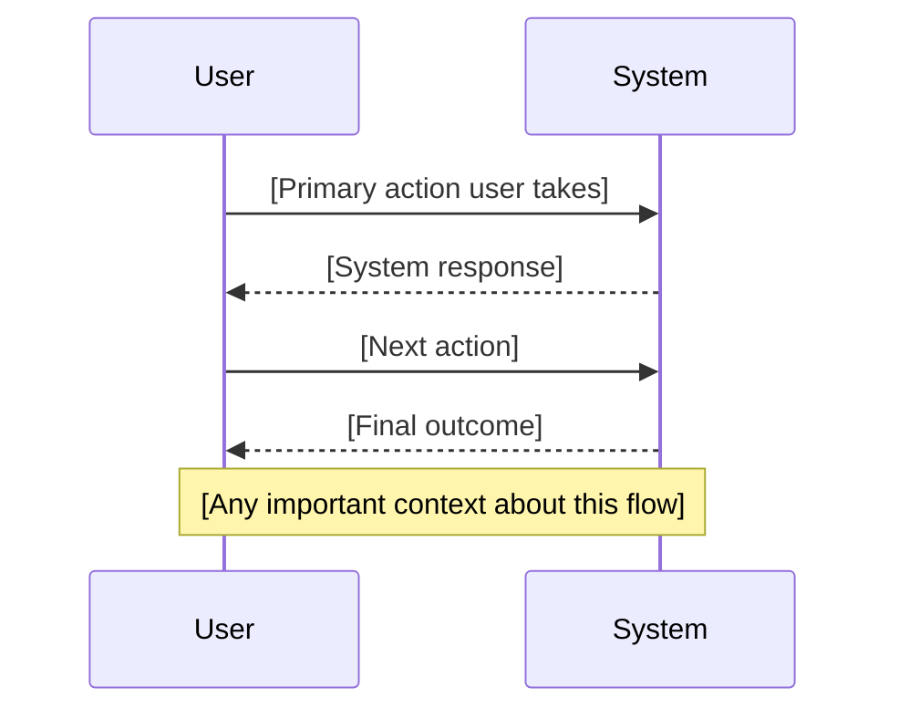
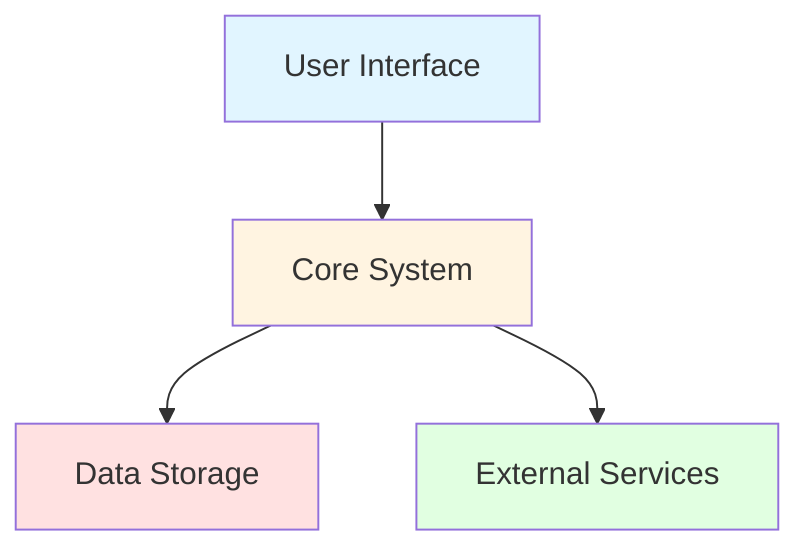
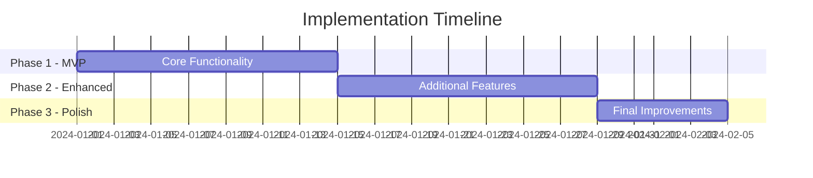
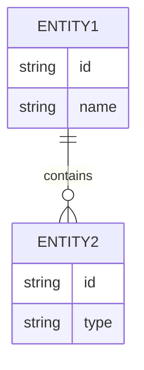

# [FEATURE NAME] - Stakeholder Overview

**Feature Branch**: `[###-feature-name]`
**Document Type**: Executive Summary & Stakeholder Communication
**Created**: [DATE]
**Last Updated**: [DATE]
**Status**: Pending Approval

---

## Executive Summary

[2-3 paragraph high-level overview written for C-level executives and non-technical stakeholders. Focus on business value, strategic impact, and user benefits. Avoid technical jargon.]

**Business Value**: [One clear sentence explaining why this matters to the business]

**Strategic Alignment**: [How this feature aligns with company goals and strategic initiatives]

**Investment Required**: [High-level estimate of time/resources in business terms - e.g., "4-6 weeks with 2 developers"]

---

## Approval & Governance

### Approval Status

| Stakeholder | Role | Status | Date | Comments |
| --- | --- | --- | --- | --- |
| [To be assigned] | Executive Sponsor | Pending | - | - |
| [To be assigned] | Product Owner | Pending | - | - |
| [To be assigned] | Technical Lead | Pending | - | - |

**Instructions**: Update this table as approvals are received. Status values: Pending, Approved, Rejected, In Review.

### Decision Log

| Date | Decision | Rationale | Decided By | Impact |
| --- | --- | --- | --- | --- |
| [Date] | [What was decided] | [Why this decision was made] | [Decision maker] | High/Med/Low |

**Instructions**: Append new rows as major decisions are made. Do not remove existing entries.

### Change History

| Version | Date | Changes | Author | Reason |
| --- | --- | --- | --- | --- |
| 1.0 | [DATE] | Initial draft | AI Agent | Initial stakeholder documentation |

**Instructions**: Append new rows when spec-stak.md is updated. Auto-increment version (1.0 → 1.1 → 1.2).

---

## Business Case

### Problem Statement

[Clear description of the business problem or opportunity. What pain points are we addressing? What market need are we fulfilling?]

### Proposed Solution

[High-level description of what we're building, written for non-technical audiences. Focus on capabilities and user benefits, not implementation details.]

### Success Metrics

| Metric | Target | Measurement Method | Timeline |
| --- | --- | --- | --- |
| [KPI name] | [Target value] | [How it will be measured] | [When target should be achieved] |
| [Example: User adoption] | [Example: 1000 active users] | [Example: Analytics dashboard] | [Example: 3 months post-launch] |
| [Example: Task completion time] | [Example: Under 2 minutes] | [Example: User testing] | [Example: At launch] |

### Return on Investment (ROI)

**Estimated Costs**:

- Development: [Estimated hours or weeks]
- Resources: [Team composition - e.g., 2 developers, 1 designer]
- Infrastructure: [Any new infrastructure costs]
- Total estimated cost: [Dollar amount or resource commitment]

**Expected Benefits**:

- [Quantifiable benefit 1 - e.g., "Reduce support tickets by 30%"]
- [Quantifiable benefit 2 - e.g., "Increase user engagement by 20%"]
- [Qualitative benefit - e.g., "Improved brand reputation"]

**ROI Timeline**: [When positive return is expected - e.g., "6 months after launch"]

---

## User Impact & Value

### Primary User Personas

[Brief descriptions of who will benefit from this feature. Include user types, their goals, and how this feature helps them.]

**Example**:

- **End Users**: People who will use the primary feature to [achieve goal]
- **Administrators**: People who manage and configure the system
- **Stakeholders**: People who gain insight or reporting capabilities

### User Journey Visualization

**Instructions**: This diagram will be auto-generated from the P1 user story in spec.md. Edit manually if needed for stakeholder clarity.

### Value Delivery by Priority

#### Priority 1 (Must Have) - MVP Features

[List P1 user stories in business language]

- **[Story title]**: [What users can do and why it matters]
  - **User benefit**: [Concrete benefit users receive]
  - **Business value**: [Why this is critical for the business]

#### Priority 2 (Should Have) - Enhanced Features

[List P2 user stories in business language]

- **[Story title]**: [What users can do and why it matters]
  - **User benefit**: [Concrete benefit users receive]

#### Priority 3 (Nice to Have) - Polish Features

[List P3 user stories in business language]

- **[Story title]**: [What users can do and why it matters]

---

## Implementation Overview

### High-Level Architecture

**Instructions**: This diagram will be auto-generated from Key Entities in spec.md. Components represent major system parts in business terms.

**Key Components**:

- **[Component 1]**: [What it does in business language]
- **[Component 2]**: [What it does in business language]
- **[Component 3]**: [What it does in business language]

### Delivery Phases

**Instructions**: This timeline will be estimated based on user story priorities. Adjust dates as actual project plan is finalized.

**Phase Breakdown**:

- **Phase 1 (MVP)**: [What will be delivered - P1 features]
- **Phase 2 (Enhanced)**: [What will be delivered - P2 features]
- **Phase 3 (Polish)**: [What will be delivered - P3 features]

### Key Entities & Data Model

**Instructions**: This diagram will be auto-generated from Key Entities section in spec.md. Shows main data structures in simplified form.

---

## Risk Assessment & Mitigation

### Identified Risks

| Risk | Likelihood | Impact | Mitigation Strategy | Owner |
| --- | --- | --- | --- | --- |
| [Risk description] | High/Med/Low | High/Med/Low | [How we'll address it] | [Person responsible] |
| [Example: Timeline constraints] | [Med] | [High] | [Buffer time in estimates, clear scope definition] | [PM] |
| [Example: Technical complexity] | [Med] | [Med] | [Proof of concept, expert consultation] | [Tech Lead] |

### Dependencies & Constraints

**External Dependencies**:

- **[Dependency 1]**: [Status and risk level - e.g., "Third-party API (stable, low risk)"]
- **[Dependency 2]**: [Status and risk level]

**Technical Constraints**:

- [Constraint 1 in business language - e.g., "Must work on mobile devices"]
- [Constraint 2 - e.g., "Must maintain performance with 10,000 concurrent users"]

**Business Constraints**:

- **Timeline**: [Any hard deadline constraints]
- **Budget**: [Any budget limitations]
- **Resources**: [Team availability or limitations]
- **Regulatory**: [Any compliance or legal requirements]

---

## Decision Framework

### Assumptions Made

[List key assumptions that were made during specification. These may need validation with stakeholders.]

- [Assumption 1]
- [Assumption 2]
- [Assumption 3]

### Open Questions

[List questions that need stakeholder input or decision. These should be resolved before final approval.]

**Priority**: High/Medium/Low

1. [Question requiring stakeholder decision]
2. [Question requiring stakeholder decision]
3. [Question requiring stakeholder decision]

### Alternatives Considered

[Document any alternative approaches that were considered and why they were not chosen. Helpful for future reference.]

| Alternative | Pros | Cons | Why Not Chosen |
| --- | --- | --- | --- |
| [Approach A] | [Benefits] | [Drawbacks] | [Reason for rejection] |
| [Approach B] | [Benefits] | [Drawbacks] | [Reason for rejection] |

---

## Stakeholder Communication Plan

### Review Checkpoints

| Checkpoint | Purpose | Participants | Timing | Status |
| --- | --- | --- | --- | --- |
| Initial Review | Validate business case and approach | [Executive Sponsor, Product Owner] | [Date] | Pending |
| Design Review | Architecture and technical approach approval | [Technical Lead, Architects] | [After plan.md created] | Pending |
| Mid-Implementation Review | Progress check and course correction | [PM, Product Owner, Stakeholders] | [Midpoint of implementation] | Pending |
| Final Review | Acceptance and launch readiness | [All stakeholders] | [Before production release] | Pending |

### Communication Channels

- **Primary**: [Channel for main communication - e.g., "Weekly stakeholder meetings"]
- **Updates**: [Frequency - e.g., "Bi-weekly status emails"]
- **Escalation**: [Process for urgent issues - e.g., "Direct message to Executive Sponsor"]
- **Documentation**: [Where docs are stored - e.g., "Confluence, GitHub, shared drive"]

### Key Stakeholders

| Name | Role | Interest Level | Influence Level | Engagement Strategy |
| --- | --- | --- | --- | --- |
| [Name] | [Role] | High/Med/Low | High/Med/Low | [How to keep them engaged] |

---

## Appendix: Technical Details

For detailed technical specifications and implementation plans, see:

- **Technical Specification**: `specs/[###-feature-name]/spec.md`
- **Implementation Plan**: `specs/[###-feature-name]/plan.md`
- **Task Breakdown**: `specs/[###-feature-name]/tasks.md`
- **Research & Analysis**: `specs/[###-feature-name]/research.md`
- **Data Model Details**: `specs/[###-feature-name]/data-model.md`

---

**Document Information**:

- **Last Generated**: [Timestamp]
- **Generated By**: Spec Kit `/speckit.stak` command
- **Version**: 1.0
- **Status**: Pending Approval

**Instructions for Stakeholders**:

- Review each section thoroughly, paying special attention to Business Case, Success Metrics, and ROI
- Update Approval Status table with your decision and comments
- Add entries to Decision Log as major decisions are made
- Raise Open Questions during review meetings
- This document will be updated as the technical specification evolves - check Change History for what changed

<!-- AUTO-GENERATED: This document is managed by the /speckit.stak command. Manual edits are preserved during updates. -->
